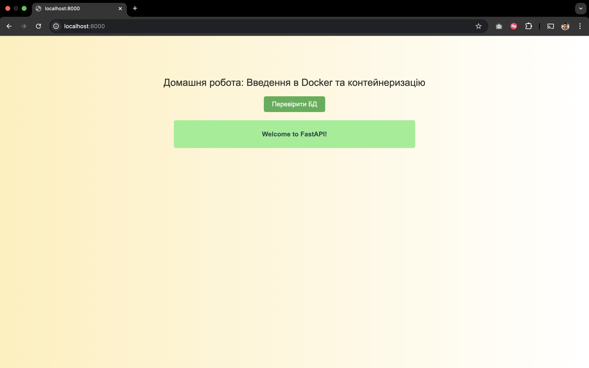
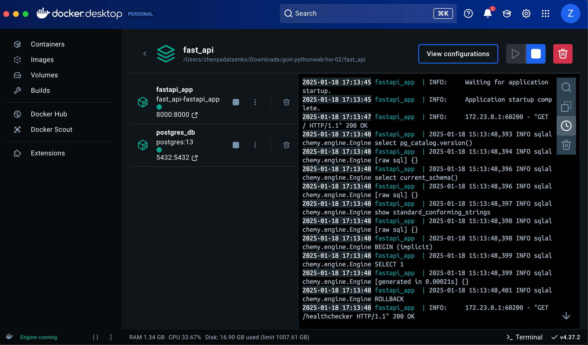

# FastAPI Application Deployment with Docker

## Task Overview

This task involves deploying a FastAPI application using Docker. You will clone the application repository, set it up, and run it in a Docker container. Finally, you will verify the application's functionality and database connectivity.

## Steps to Complete the Task

1. **Clone the Repository**

   ```bash
   git clone https://github.com/GoIT-Python-Web/FullStack-Web-Development-hw2
   cd FullStack-Web-Development-hw2
   ```

2. **Create a Dockerfile**

   - Create a `Dockerfile` with instructions to build the Docker image for the application.

3. **Write docker-compose.yaml**

   - Create a `docker-compose.yaml` file with the configuration for the application and PostgreSQL.

4. **Modify Database Connection**

   - Update the `SQLALCHEMY_DATABASE_URL` in `conf/db.py`:
     ```python
     SQLALCHEMY_DATABASE_URL = f"postgresql+psycopg2://postgres:567234@<postgres_service_name>:5432/hw02"
     ```

5. **Build and Run the Environment**

   ```bash
   docker-compose up
   ```

6. **Verify Application Functionality**
   - Open your browser and check the application.
   - Click the "Check DB" button to confirm database connectivity.

## Expected Results

- **Application Home Page**
  

- **Database Check Result**
  

- **Docker**
  
